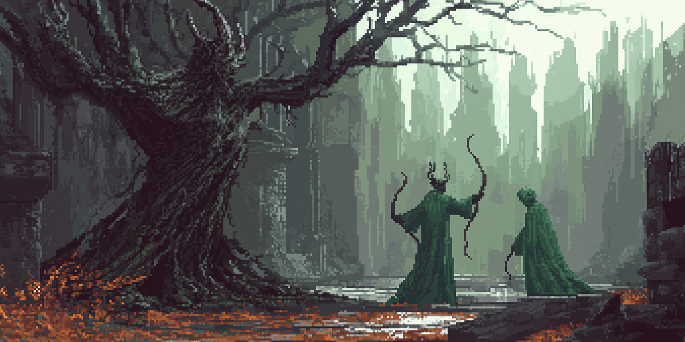
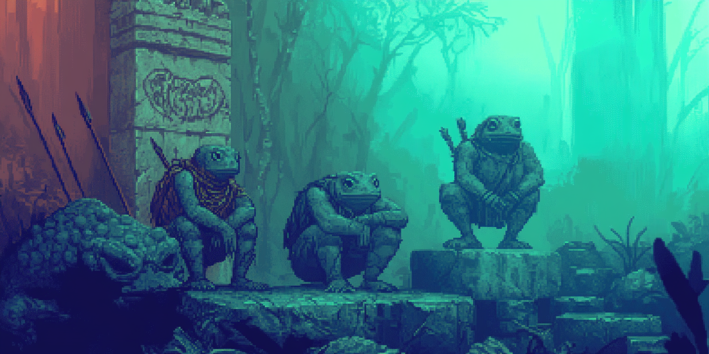
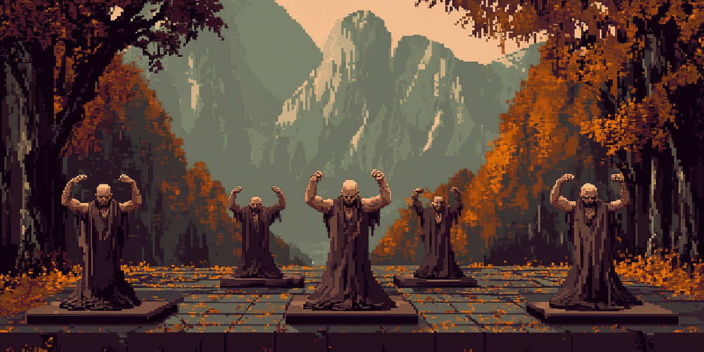
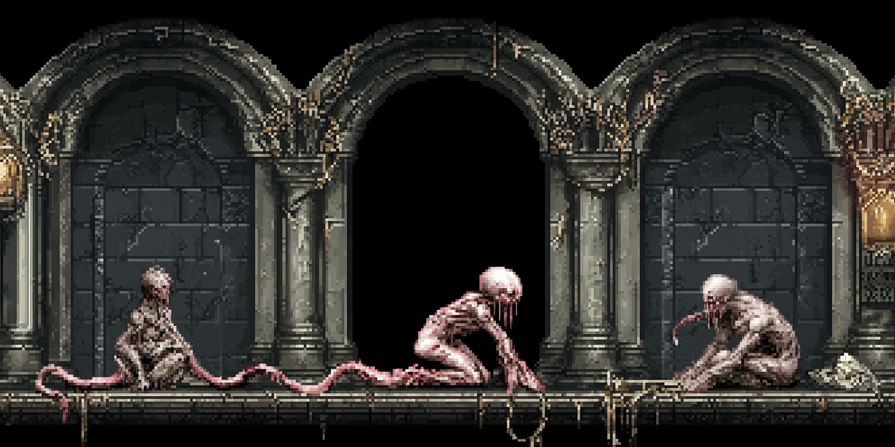
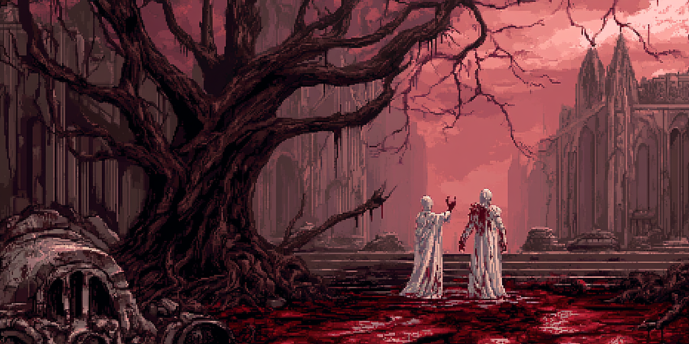
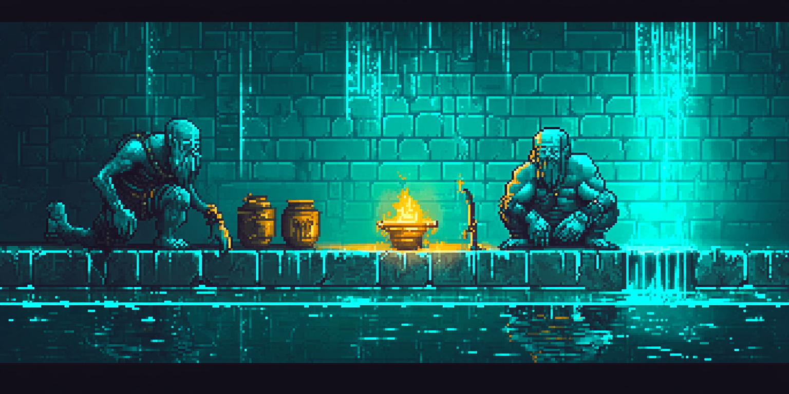
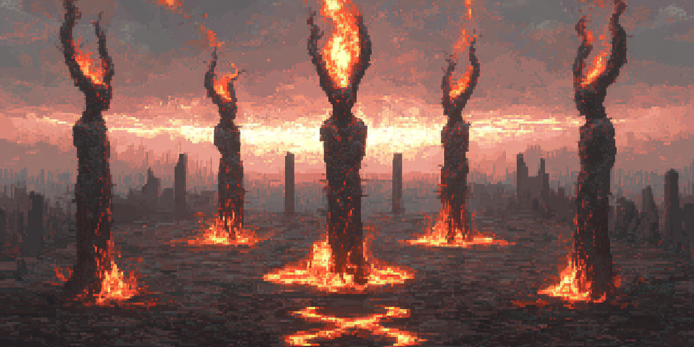

# RoomianRealms (v0.55)

### The Shattering

The current age was born from **The Shattering**, a cataclysm triggered when the **Chronoworm**, a colossal, reality-bending entity from another plane, tore through the fabric of the realms. This violent intrusion fractured the world and extinguished several of the ancient **Astari** gods, including **Bardok** (mentioned as defeated by Athuri) and the powerful **Shmalor**, whose void essence dissolved into potent, corrupting energy.

The surviving Astari—**Athuri** (Wisdom & Harmony), **Crator** (Creation & Order), and **Aminion** (Chaos & Destruction)—along with the enigmatic **Shmalor** (now known primarily as the Trickster, embodying Cunning & Opportunity), struggled to impose their wills on the fractured reality.

The Chronoworm's passage left an indelible scar: **void residue**, the lingering essence of the fallen aspect of Shmalor, now infused within the common **Sithilon Ore**. This ore, pulsating with transformative power, became a focal point for the eight surviving civilizations—Satyrs, Froggians, Northmen, Pasunkas, Wormlings, Bloodelves, Finestorians, and Hellspawn. Each race seeks to harness its potential, navigating a world forever changed by the echo of the void and the shifting balance of the remaining gods.

### The Eight Civilizations

|  |  |
|:---:|:---:|
| **Satyrs** | **Froggians** |
| **Category**: Children of Light | **Category**: Children of Light |
| **Deity**: Athuri | **Deity**: Athuri |
| **Size**: Medium (Adult: 80 Days) | **Size**: Small (Adult: 60 Days) |
| Forest-dwelling, nature-oriented beings with strong spiritual connections. They excel in archery and hunting, with a deep understanding of herbal wisdom. | Amphibious race renowned for their innovation, diplomacy, and harmonious lifestyles. They live in perfect balance with nature, while developing remarkable technologies. |

|  |  |
|:---:|:---:|
| **Northmen** | **Pasunkas** |
| **Category**: Heirs of Balance | **Category**: Heirs of Balance |
| **Deity**: Crator/Shmalor | **Deity**: Crator |
| **Size**: Medium (Adult: 80 Days) | **Size**: Medium (Adult: 90 Days) |
| Hardy humans with Norse-inspired society, skilled in battle and craftsmanship. They value honor and practical knowledge, forming the backbone of many trade networks. | Disciplined engineers with a deep connection to geometric patterns and architecture. Their society thrives on order and structured social hierarchies. |

|  |  |
|:---:|:---:|
| **Wormlings** | **Bloodelves** |
| **Category**: Breakers of Reality | **Category**: Breakers of Reality |
| **Deity**: Shmalor/God Emperor | **Deity**: Aminion/Shmalor |
| **Size**: Small (Adult: 15 Days) | **Size**: Medium (Adult: 85 Days) |
| Alien hive-minded entities from beyond reality with a unique connection to the void. They communicate telepathically and possess an otherworldly understanding of dimensional physics. | Fallen elves corrupted by blood magic and chaos, embracing pain as enlightenment. Their society values personal transformation through suffering. |

|  |  |
|:---:|:---:|
| **Finestorians** | **Hellspawn** |
| **Category**: Arbiters of Order | **Category**: Arbiters of Order |
| **Deity**: Crator | **Deity**: Aminion |
| **Size**: Large (Adult: 120 Days) | **Size**: Large (Adult: 110 Days) |
| Technologically advanced beings with a deep respect for order and perfection. Their society emphasizes intellectual achievement and architectural grandeur. | Monstrous beings born of chaos and fire with an insatiable bloodlust. Their society thrives on conquest and dominance, with a harsh survival-of-the-strongest hierarchy. |

- **Children of Light** (Good Races)
  - Satyrs (ARGONOSH) - Female-dominated forest dwellers who value nature and defense
  - Froggians (Q_AMEVIA) - Amphibious beings who embody wisdom and technology

- **Heirs of Balance** (Neutral Races)
  - Finestorians (DONDORIAN) - Craftsmen who value skill and honest labor
  - Northmen (HUMAN) - Pragmatic traders and warriors driven by ambition

- **Servants of Shadow** (Evil Races)
  - Hellspawns (TILAPI) - Demonic entities that embody chaos and destruction
  - Bloodelves (CANTOR) - Vampire-like beings who maintain slaves for blood consumption

- **The Outsiders** (Beyond Morality)
  - Wormlings (GARTHIMI) - Parasitic entities that infest hosts
  - Pasunkas (CRETONIAN) - Spiritual martial artists who value discipline

### Divine Powers

- **The Fallen One (Aminion)** - Lord of chaos who rebelled against the cosmic order. Once a powerful Astari, Aminion sought to remake reality in his own image. Primarily worshipped by Hellspawns and Bloodelves.

- **The Leader (Athuri)** - Greatest of the Astari, who embodies wisdom, harmony, and the natural order. Defeated his brother Bardok in both cosmic wars, establishing balance in the world. Primarily worshipped by Satyrs and Froggians.

- **The Creator (Crator)** - Divine Architect and foremost creator among the Astari, who shaped the physical world and its many creatures. His temples celebrate craftsmanship, discipline, and the perfection of form. Primarily worshipped by Pasunkas and Finestorians.

- **The Slain Queen (Shmalor)** - Queen of the Agonosh, who represents the cosmic void and the spaces between realities. Slain during the first war of the gods, her death tore the veil between dimensions. Primarily worshipped by Wormlings.

- **The God Emperor** - An alien entity from beyond reality that entered Roomia through The Breach created by Shmalor's death. Unlike the other deities who were once gods of Roomia, the God Emperor is an extradimensional presence whose consciousness exists primarily in the void between dimensions. The Wormlings contain fragments of its essence, allowing them to perceive multiple realities simultaneously. The ultimate goal of its worship is transcendence - preparing Roomia for the God Emperor's eventual return.

### Character Traits System

The mod features a comprehensive trait system with:

- **Race-Specific Traits**: Each race has 8 unique traits that reflect their cultural and biological characteristics
- **Elite Traits**: Rare and powerful traits with very low occurrence rates (0.5-1.5%)
- **Religious Devotee Traits**: Special traits for devoted followers of each of the five deities
- **Balanced Distribution**: Traits are distributed appropriately based on race population sizes
- **Mutual Exclusivity**: Thematically opposite traits cannot be possessed simultaneously

### Custom Music

Immerse yourself in the world of Roomian Realms with a custom soundtrack that enhances the atmosphere of your empire.

## Installation

1. Download the latest release from the [Releases page](https://github.com/Thothius/roomian-realms/releases)
2. Extract the contents to your Songs of Syx mods folder (usually located at `C:\Users\[YourUsername]\AppData\Roaming\songsofsyx\mods\`)
3. Launch Songs of Syx and enable the mod in the Mods menu
4. Start a new game to experience all features

## Compatibility

- Compatible with Songs of Syx version 68
- Not compatible with previous versions

## Changelog

### Version 0.55 (New Release)
- Updated Overview to reflect new lore
- Removed 'What's New in Version 0.52' section

### Version 0.52 (April 15, 2025)
- Added Race Enhancement Patch v1, standardizing race sizes and rebalancing adult maturation ages
- Updated documentation to reflect changes in version 0.52

### Version 0.51 (March 31, 2025)
- Added 41 race-specific trait files for all 8 races
- Implemented the God Emperor as the fifth deity in the religious framework
- Fixed references to deities in documentation
- Updated trait system to reflect the expanded religious framework

### Version 0.5 (Previous Release)
- Streamlined building system by removing complex and redundant structures
- Enhanced military buildings with new functionality
- Expanded religious framework and lore
- Added custom music

## Credits

- Mod created by Ted
- Special thanks to the Songs of Syx modding community

## License

This project is licensed under the MIT License - see the LICENSE file for details.
