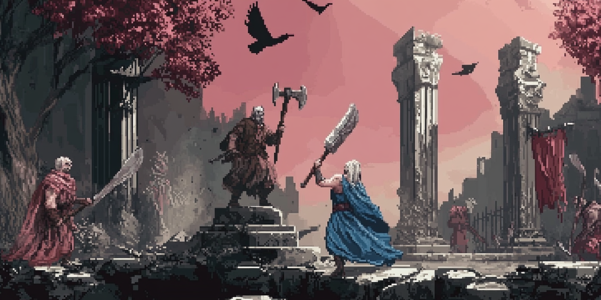
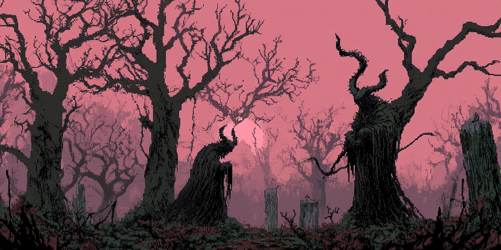
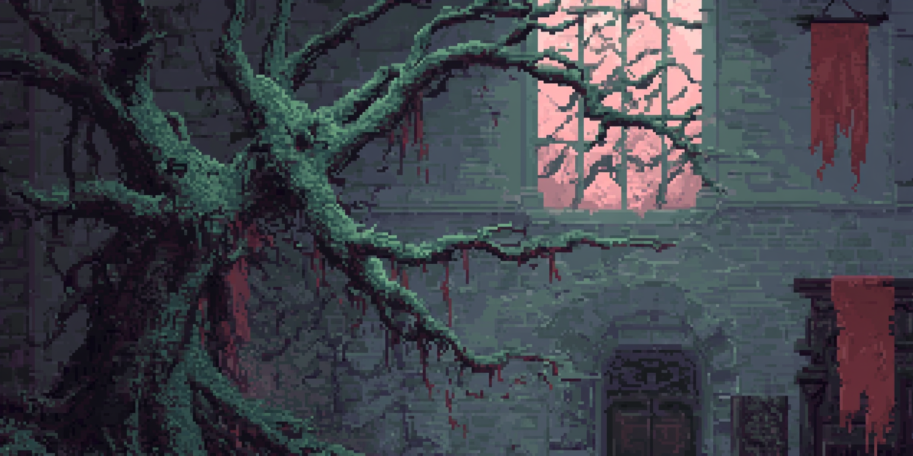
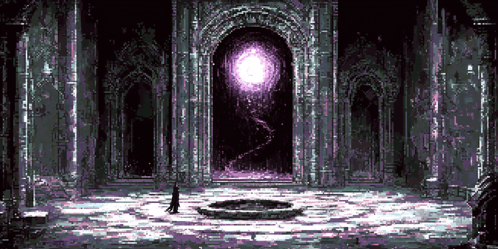
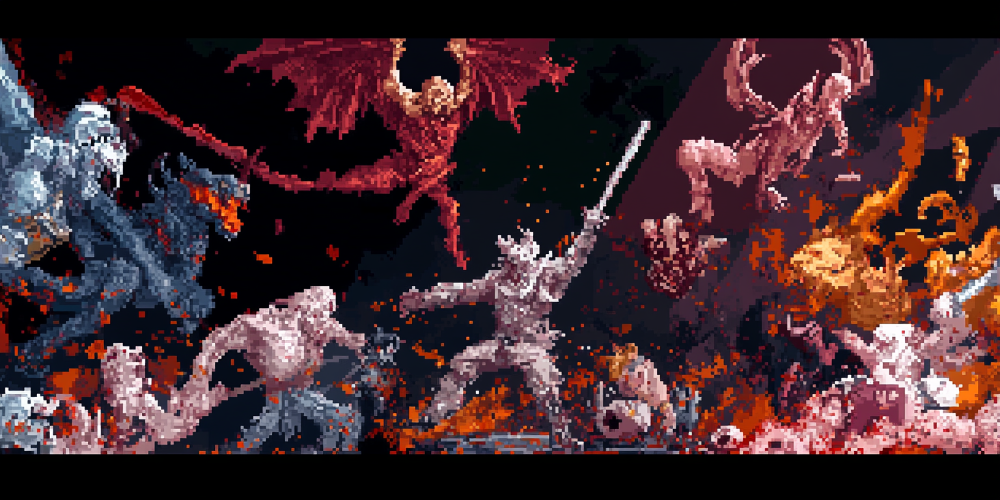

# RoomianRealms (v0.55)

### The Shattering

The current age was born from **The Shattering**, a cataclysm triggered when the **Chronoworm**, a colossal, reality-bending entity from another plane, tore through the fabric of the realms. This violent intrusion fractured the world and extinguished several of the ancient **Astari** gods, including **Bardok** (mentioned as defeated by Athuri) and the powerful **Shmalor**, whose essence dissolved into potent, corrupting energy.

The surviving Astari—**Athuri** (Wisdom & Harmony), **Crator** (Creation & Order), and **Aminion** (Chaos & Destruction)—along with the enigmatic **Shmalor** (or what's left of him), struggled to impose their wills on the fractured reality.

The Chronoworm's passage left an indelible scar: **void residue**, the lingering essence of the fallen aspect of Shmalor, now infused within the common **Sithilon Ore**. This ore, pulsating with transformative power, became a focal point for the eight surviving civilizations—Satyrs, Froggians, Northmen, Pasunkas, Wormlings, Bloodelves, Finestorians, and Hellspawn. Each race seeks to harness its potential, navigating a world forever changed by the echo of the void and the shifting balance of the remaining gods.

### The Eight Civilizations

|  |  |
|:---:|:---:|
| **Satyrs** | **Froggians** |
| **Category**: Children of Light | **Category**: Children of Light |
| **Deity**: Athuri | **Deity**: Athuri |
| **Size**: Medium (Adult: 80 Days) | **Size**: Small (Adult: 60 Days) |
| Forest-dwelling, nature-oriented beings with strong spiritual connections. They excel in archery and hunting, with a deep understanding of herbal wisdom. | Amphibious race renowned for their innovation, diplomacy, and harmonious lifestyles. They live in perfect balance with nature, while developing remarkable technologies. |

|  |  |
|:---:|:---:|
| **Northmen** | **Pasunkas** |
| **Category**: Heirs of Balance | **Category**: Heirs of Balance |
| **Deity**: Crator/Shmalor | **Deity**: Crator |
| **Size**: Medium (Adult: 80 Days) | **Size**: Medium (Adult: 90 Days) |
| Hardy humans with Norse-inspired society, skilled in battle and craftsmanship. They value honor and practical knowledge, forming the backbone of many trade networks. | Disciplined engineers with a deep connection to geometric patterns and architecture. Their society thrives on order and structured social hierarchies. |

|  |  |
|:---:|:---:|
| **Wormlings** | **Bloodelves** |
| **Category**: Breakers of Reality | **Category**: Breakers of Reality |
| **Deity**: Shmalor/God Emperor | **Deity**: Aminion/Shmalor |
| **Size**: Small (Adult: 15 Days) | **Size**: Medium (Adult: 85 Days) |
| Alien hive-minded entities from beyond reality with a unique connection to the void. They communicate telepathically and possess an otherworldly understanding of dimensional physics. | Fallen elves corrupted by blood magic and chaos, embracing pain as enlightenment. Their society values personal transformation through suffering. |

|  |  |
|:---:|:---:|
| **Finestorians** | **Hellspawn** |
| **Category**: Arbiters of Order | **Category**: Arbiters of Order |
| **Deity**: Crator | **Deity**: Aminion |
| **Size**: Large (Adult: 120 Days) | **Size**: Large (Adult: 110 Days) |
| Technologically advanced beings with a deep respect for order and perfection. Their society emphasizes intellectual achievement and architectural grandeur. | Monstrous beings born of chaos and fire with an insatiable bloodlust. Their society thrives on conquest and dominance, with a harsh survival-of-the-strongest hierarchy. |

### Divine Powers

The Roomian Realms are influenced by the remaining Astari gods, each representing fundamental forces:

| Aminion (The Fallen One) | Athuri (The Leader) |
| :----------------------: | :-----------------: |
|  |  |
| Lord of Chaos. Once a powerful Astari, he embraced destruction and now seeks to twist reality to his will. Worshipped primarily by **Hellspawns** and **Bloodelves**, who value power gained through suffering and domination. | Embodiment of Wisdom and Harmony. Athuri fought to preserve balance during the cosmic wars and represents the natural order and the pursuit of knowledge. Worshipped primarily by **Satyrs** and **Froggians**, who seek alignment with nature and collective understanding. |

| Crator (The Creator) | Shmalor (The Shattered One / The Trickster) |
| :------------------: | :-----------------------------------------: |
|  |  |
| The Divine Architect. Crator shaped the physical realm and embodies the principles of creation, order, and the perfection of form through discipline and skill. Worshipped primarily by **Pasunkas** and **Finestorians**, who value mastery, structure, and craftsmanship. Revered also by **Northmen** for blessing their shipbuilding and weapon-forging. | Represents the duality of the Void and Cunning. The original **Void God** aspect of Shmalor was destroyed during **The Shattering**, its essence dissolving into the **void residue** now sought by the **Wormlings**. However, an enigmatic **Trickster** aspect survived, embodying opportunity, adaptation, and manipulation. This aspect is revered by **Northmen** (for success in trade and cunning strategy) and **Bloodelves** (for political maneuvering and exploiting weakness). |

### Custom Music

Immerse yourself in the world of Roomian Realms with a custom soundtrack that enhances the atmosphere of your empire.

## Installation

1. Download the latest release from the [Releases page](https://github.com/Thothius/roomian-realms/releases)
2. Extract the contents to your Songs of Syx mods folder (usually located at `C:\Users\[YourUsername]\AppData\Roaming\songsofsyx\mods\`)
3. Launch Songs of Syx and enable the mod in the Mods menu
4. Start a new game to experience all features

## Compatibility

- Compatible with Songs of Syx v68

## Changelog

### Version 0.55 (New Release)
- Updated Overview to reflect new lore
- Removed 'What's New in Version 0.52' section

### Version 0.52 (April 15, 2025)
- Added Race Enhancement Patch v1, standardizing race sizes and rebalancing adult maturation ages
- Updated documentation to reflect changes in version 0.52

### Version 0.51 (March 31, 2025)
- Added 41 race-specific trait files for all 8 races
- Implemented the God Emperor as the fifth deity in the religious framework
- Fixed references to deities in documentation
- Updated trait system to reflect the expanded religious framework

### Version 0.5 (Previous Release)
- Streamlined building system by removing complex and redundant structures
- Enhanced military buildings with new functionality
- Expanded religious framework and lore
- Added custom music

## Credits

- Mod created by Ted
- Special thanks to the Songs of Syx modding community

## License

This project is licensed under the MIT License - see the LICENSE file for details.
